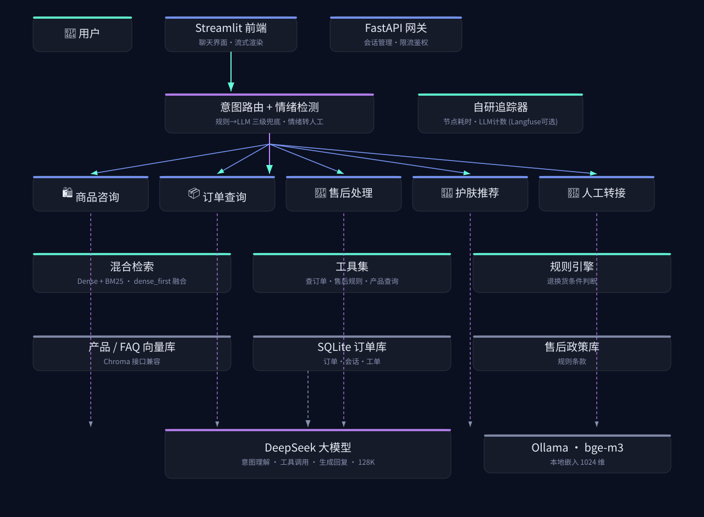
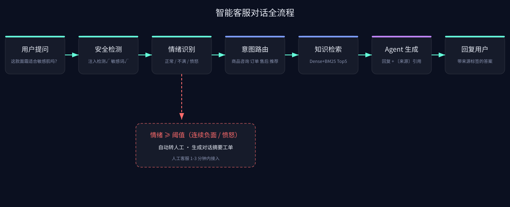

<div align="center">

# 💄 悦己美妆智能客服 Agent（YUEJI CS Agent）

基于 **LangGraph 编排 + RAG + Function Calling + 情绪转人工** 的美妆电商智能客服系统
覆盖商品咨询 · 订单查询 · 退换货 · 护肤推荐 四大场景


-28a745)


</div>

---

## 🏗️ 系统架构



**LangGraph StateGraph 编排（Supervisor-Worker）**：安全护栏 → 情绪检测 → 意图路由（Supervisor）→ 5 个 Worker Agent → 记忆回写；三级意图路由（规则 → LLM 兜底，历史感知消解指代）。

## 🔄 一次对话的完整流程



情绪愤怒/连续负面时自动转人工，并生成**带对话摘要的转接工单**（1-3 分钟内人工接入）。

## ✨ 功能一览

| 场景 | 能力 | 技术 |
|------|------|------|
| 🛍️ 商品咨询 | 成分/功效/价格/用法问答，引用溯源可点击，敏感人群提示 | RAG（Dense+BM25 **dense_first 融合**）+ 余弦相似度门槛拒答 |
| 📦 订单查询 | 订单状态/商品/金额查询，多轮槽位追问，**按用户归属隔离** | Function Calling + 槽位状态机 + 订单号/手机尾号双校验 |
| 🔄 退换货 | 售后资格判定（规则引擎）、表单式多轮、生成工单 | 规则引擎 + 状态机 + 工单系统 |
| 💆 护肤推荐 | 肤质/肌肤问题/年龄标签匹配，**品类优先**，Top3 + 搭配建议 | LLM 标签提取 + 标签打分 |
| 😡 情绪转人工 | 三级情绪检测，连续 2 轮负面 / 1 轮愤怒自动转接并带摘要工单 | 情感词典 + 规则 + 会话级平滑 |
| 📚 知识库管理 | 上传 .md/.docx/.pdf → 分块预览 → **审核入库** → 回滚，客服即时学会新知识 | 自研 KB 服务（借鉴 Langchain-Chatchat 模式）+ Streamlit 管理页 |

## 🚀 快速开始

```bash
python3 -m venv .venv && source .venv/bin/activate
pip install -r requirements.txt
cp .env.example .env        # 填入 DEEPSEEK_API_KEY

python -m scripts.gen_data       # 生成数据（产品/FAQ/政策）
python -m scripts.gen_orders     # 生成模拟订单
python -m scripts.ingest         # 知识库向量化（需 Ollama bge-m3）

python -m uvicorn src.api.main:app --port 8000 &   # 后端
streamlit run frontend/app.py                       # 前端 http://localhost:8501
```

自检：`python -m scripts.check_env` ｜ 公网部署：见 [`docs/公网部署方案.md`](docs/公网部署方案.md)

## 🧪 评测体系（双轨：确定性断言 + LLM-as-Judge）

```bash
python -m pytest tests/ -q                  # 50 项单元测试（含 LangGraph/追踪测试）
python -m eval.evaluate                     # 100 条测试集双轨评测（走 LangGraph 路径）
python -m scripts.compare_retrieval         # 检索四策略对比 → docs/检索策略对比报告.md
python -m scripts.trace_report --html       # 自研可观测性报告 + HTML 看板
python -m scripts.stress_test --concurrency 50
```

**最终评测（100 条测试集，[完整报告](eval/reports/20260825_204702_report.md)）**：

| 指标 | 结果 | 目标 |
|------|------|------|
| 问题解决率（LangGraph 路径） | **100%** (100/100) | ≥75% |
| 幻觉率 | **0%** | ≤5% |
| 转人工 Precision / Recall | **100% / 100%** | ≥85% / ≥90% |
| 情绪识别 | **100%** (30/30) | ≥80% |
| 检索 Recall@10 / MRR@10 / NDCG@5 | **98.9% / 0.942 / 0.852** | ≥85% / 0.7 / 0.75 |
| 中位 / P95 延迟 | **2.84s / 4.6s** | <3s / <8s |
| 流式 TTFT | **~2.0s** | <3s |
| 并发 50 | **100% 成功，无 5xx** | — |

> 调优路径：问题解决率 69% → 95% → 99% → **100%**；检索 Recall@10 92.8% → **98.9%**（dense_first 融合）。
> 实验细节与决策记录见 [`docs/开发笔记.md`](docs/开发笔记.md)（ADR-001~010）。

## 📊 技术栈

**Python 3.14** · **LangGraph**（StateGraph）· FastAPI · Streamlit · DeepSeek API · Ollama(bge-m3) · rank-bm25 · SQLite · **自研 JSONL 追踪器**（Langfuse 可选上报）· pytest · Docker

## 🛡️ 安全设计

- Prompt 注入检测（规则 + 关键词）、敏感内容拦截
- 订单查询强制「订单号 + 手机尾号」双校验 + **user_id 归属隔离**（防越权）
- PII 脱敏（日志/追踪记录手机号打码）
- 会话级限流（20 req/min）

## 📁 目录结构

```text
├── config/settings.py      # 集中配置
├── src/
│   ├── graph/              # LangGraph 编排（state/nodes/workflow）
│   ├── agents/             # 5 个专项 Agent + 编排器
│   ├── rag/                # 混合检索（dense_first 融合）
│   ├── tools/              # 订单/售后/产品工具 + 注册表
│   ├── api/  memory/  emotion/  session/  llm/  utils/
├── frontend/app.py         # Streamlit 界面（对话页 + 知识库管理页）
│   ├── src/kb/               # 知识库管理（解析/审核/回滚）
├── eval/                   # 测试集 + 评测脚本 + 报告
├── scripts/                # 数据生成/评测/追踪/压测/部署
├── tests/                  # 50 项 pytest 单测
├── assets/                 # 架构图/流程图
└── docs/                   # 规划/部署/开发笔记/报告
```

## 📄 文档

- [项目规划（独一份·环境定制版）](docs/项目规划_美妆电商客服Agent.md)
- [检索策略对比报告](docs/检索策略对比报告.md)
- [自研可观测性报告](docs/可观测性报告.md)
- [公网部署方案](docs/公网部署方案.md)
- [部署手册](docs/部署手册.md)
- [开发笔记（决策记录/调优）](docs/开发笔记.md)
