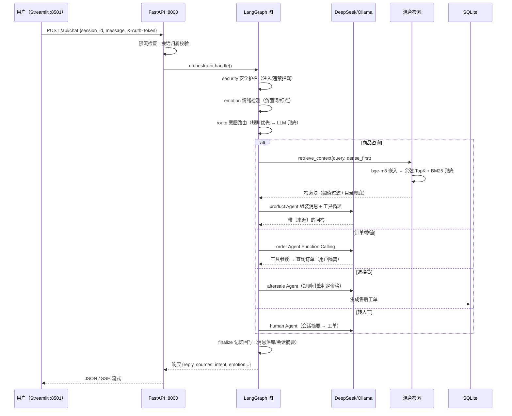

# 悦己美妆智能客服 Agent —— 完整技术栈流程图

> 与代码现状对齐（2026-08）。GitHub 直接渲染 Mermaid；本地可用 `mermaid-cli` 或 VS Code Mermaid 插件查看。

## 1. 完整技术栈分层架构

```mermaid
flowchart TB
    subgraph FE["🎨 前端层 · Streamlit"]
        U["用户端 :8501<br/>/portal 门户 · /login 登录 · /user 专属客服<br/>侧栏：我的会话 / 我的订单"]
        A["管理后台 :8502（独立子应用）<br/>米黄登录 → 深色管理<br/>KB 管理 · 检索测试 · 评估报表"]
    end

    subgraph API["🔌 接入层 · FastAPI :8000"]
        CHAT["/api/chat · /api/chat/stream(SSE)"]
        AUTH["/api/auth/* · /api/session* · /api/orders/me<br/>（X-Auth-Token 用户隔离）"]
        KB["/api/kb/*（X-Admin-Token 门禁 + 操作审计）<br/>upload-batch · docs · query-test · export<br/>retrieval-report · index-status · rebuild"]
    end

    subgraph ORCH["🧠 编排层 · LangGraph StateGraph（Supervisor-Worker）"]
        direction LR
        SEC["security<br/>安全护栏"]
        EMO["emotion<br/>三级情绪检测"]
        RTE["route<br/>意图路由<br/>规则+LLM 兜底"]
        W1["product<br/>商品咨询"]
        W2["order<br/>订单/物流"]
        W3["aftersale<br/>退换货/工单"]
        W4["skincare<br/>护肤推荐"]
        W5["human<br/>转人工"]
        FIN["finalize<br/>记忆回写/响应组装"]
        SEC --> EMO
        EMO --> RTE
        RTE --> W1
        RTE --> W2
        RTE --> W3
        RTE --> W4
        RTE --> W5
        W1 --> FIN
        W2 --> FIN
        W3 --> FIN
        W4 --> FIN
        W5 --> FIN
    end

    subgraph LLM["🤖 LLM 层"]
        DS["DeepSeek deepseek-chat（主）<br/>JSON 模式 / 工具调用 / 流式"]
        OL["Ollama qwen2.5:1.5b（备）<br/>主备自动切换"]
        RT["指数退避重试<br/>429/5xx/传输错误"]
    end

    subgraph RAG["📚 RAG 层"]
        EMB["Embedding<br/>Ollama bge-m3 · 1024维"]
        VS["向量库<br/>numpy VectorStore<br/>(vector_index.npz)"]
        BM["BM25 关键词<br/>(rank_bm25)"]
        FUSE["混合检索<br/>dense_first / rrf"]
        GATE["双阈值<br/>余弦0.55 / 融合分0.02"]
        CAT["目录兜底<br/>热门产品 Top8"]
        EMB --> VS
        VS --> FUSE
        BM --> FUSE
        FUSE --> GATE --> CAT
    end

    subgraph DATA["🗄️ 数据层"]
        SQL["SQLite (WAL)<br/>orders · sessions · messages · tickets<br/>users · auth_tokens · kb_docs · kb_query_log"]
        IDX["索引文件 data/processed/<br/>base_vectors.npz + chunks.json<br/>vector_index.npz + meta.json"]
        TRC["追踪 data/traces/*.jsonl"]
    end

    subgraph OPS["🔧 工程化 / 可观测"]
        CI["GitHub Actions CI<br/>ruff + 离线测试73项"]
        TST["pytest 83（离线73+集成10）<br/>评测100条双轨 · 检索评估267对"]
        TR["自研 Tracer + trace_report<br/>Langfuse（可选）"]
        DEP["Docker · docker-compose<br/>Caddy · 公网部署方案"]
    end

    FE -->|HTTP/SSE| API
    API --> ORCH
    ORCH -->|get_llm()| LLM
    ORCH -->|retrieve_context()| RAG
    RAG --> DATA
    ORCH -->|读写| DATA
    LLM -->|会话/审计/日志| DATA
    OPS -.->|测试/部署/观测| API
    OPS -.->|测试/部署/观测| ORCH
    OPS -.->|测试/部署/观测| LLM
    OPS -.->|测试/部署/观测| DATA
```

## 2. 单次对话时序（一次用户提问的完整链路）



## 3. 知识库数据流（管理后台 → 生效索引）

```mermaid
flowchart LR
    UP["批量上传<br/>md/txt/docx/pdf/csv/xlsx/html"] --> PARSE["解析 + 分块<br/>chunk_size/overlap 可配"]
    PARSE --> EMB["向量化<br/>bge-m3 批量 embed"]
    EMB --> PEND["待审核（kb_docs）<br/>raw_text 留存可重切"]
    PEND -->|审核通过| ACT["active 文档"]
    ACT --> REBUILD["重建合并索引<br/>基础库347块 + KB块"]
    REBUILD --> IDX["vector_index.npz<br/>chunks.json + meta.json"]
    IDX -->|invalidate()| RETR["检索器热更新<br/>客服即时命中"]
    PEND -->|拒绝| REJ["rejected"]
    ACT -->|回滚/批量删除| RB["rolled_back → 重建"]
    ACT -->|编辑分块/重新分块| REEMB["单块重向量化 → 重建"]
```

## 4. 工程化流水线（开发 → 验证 → 部署）

```mermaid
flowchart LR
    DEV["开发<br/>config · src · frontend"] --> LINT["ruff 正确性子集<br/>E9/F63/F7/F82/F401"]
    LINT --> T1["pytest 离线子集 73 项<br/>FakeLLM 注入 · 无需外部服务"]
    T1 --> CI["GitHub Actions CI<br/>push 自动触发"]
    CI --> T2["集成测试 10 项<br/>真实 DeepSeek/Ollama/服务"]
    T2 --> EVAL["评测 100 条双轨<br/>断言 + LLM-as-Judge"]
    EVAL --> REP["检索评估报表<br/>四模式 recall@3/5"]
    REP --> DEP["部署<br/>Docker / docker-compose / Caddy"]
    DEP --> OPS["运维<br/>cleanup · inspect_index · trace_report"]
```



---
配套文档：`docs/项目规划_美妆电商客服Agent.md` · `docs/项目完善规划.md` · `docs/部署手册.md` · `docs/开发笔记.md`（ADR-001~020）
