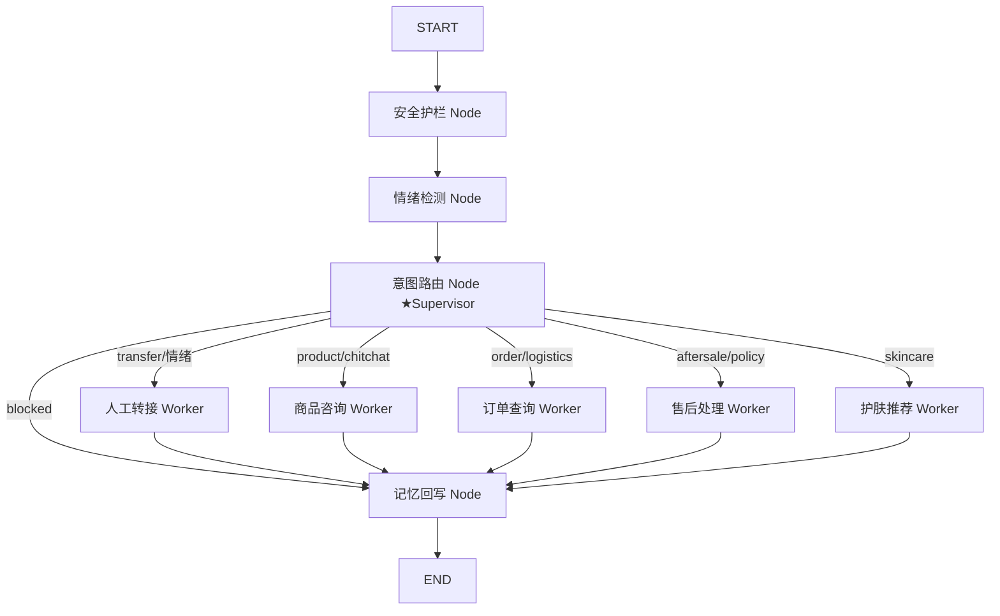

# 悦己美妆智能客服 Agent —— 项目完善规划 v2.0

> **目的**：基于 v1.0（问题解决率 100%）的复盘，补齐求职竞争力短板（框架关键词、可观测性、实验方法论），并保持"评测闭环 + 工程化"的既有优势。
> **原则**：所有改动必须通过现有 41 项单测 + 100 条双轨评测回归；接口与前端不破坏兼容。
> **周期**：3 个阶段，预计 2-3 天（本规划文档完成后由开发者独立执行）。

---

## 0. 现状盘点（v1.0 复盘）

| 维度 | 现状 | 结论 |
|------|------|------|
| 功能闭环 | 5 Agent + 三级路由 + 情绪转人工 + 安全护栏，100/100 评测 | ✅ 优势，保留 |
| 评测体系 | 100 条测试集 + LLM-as-Judge + 幻觉率 + 调优曲线 | ✅ 核心差异化 |
| 工程化 | FastAPI + SSE + Docker + 41 测试 + 压测 | ✅ 优势，保留 |
| **多 Agent 编排** | 自研 if/else 路由分发，**无 LangGraph** | ⚠️ JD 高频关键词缺失 |
| **可观测性** | 仅日志；**Langfuse 未接入**（文档仅"预留"） | ⚠️ 简历有虚报风险 |
| **实验方法论** | 检索调优有数据，但**未沉淀对比报告** | ⚠️ 面试故事缺一环 |

## 1. 完善目标（可验收）

1. **LangGraph 升级**：用 StateGraph 重构编排层（路由 → 5 Agent 节点 → 记忆回写），形成 Supervisor-Worker 模式叙事；
   - 验收：`orchestrator.handle` 走图执行；100 条评测 ≥ 99%、41 项单测全过；API/前端无感知。
2. **可观测性接入**（原计划 Langfuse，落地改为**自研 JSONL 追踪器**为主 + Langfuse 可选上报，见 ADR-010）：全链路追踪（trace/span），零依赖本地可用；环境允许则自托管/云上报产出调用链素材；
   - 验收：配置密钥后可在 Langfuse 看到一次完整对话的调用链；无密钥时系统行为不变。
3. **检索三策略对比报告**：Dense-only vs BM25-only vs 混合（RRF），30 条标注集 Recall/MRR/NDCG 对比表；
   - 验收：`docs/检索策略对比报告.md` 产出，数据可复现（脚本化）。
4. **文档与简历同步**：README 技术栈/指标、规划文档状态、开发笔记 ADR、简历模板更新；
   - 验收：文档无"虚报"（Langfuse 状态如实标注），简历模板含最终数据。

## 2. 阶段与任务分解

### Phase A：检索对比 + 文档基建（0.5 天）

- [ ] `scripts/compare_retrieval.py`：对 30 条检索标注集分别跑 ① Dense-only ② BM25-only ③ Hybrid(RRF)，输出 Recall@10 / MRR@10 / NDCG@5 对比表与 markdown 报告；
- [ ] 更新 `requirements.txt`（+langgraph +langfuse）。

### Phase B：LangGraph 编排重构（1-1.5 天）—— 本阶段核心

**目标架构（Supervisor-Worker）**：



- [ ] `src/graph/state.py`：`AgentState`（TypedDict）定义，字段对齐现有 handle 返回；
- [ ] `src/graph/nodes.py`：安全/情绪/路由/各 Agent/记忆回写节点（复用现有 agent.run，不改 Agent 内部逻辑）；
- [ ] `src/graph/workflow.py`：StateGraph 组装 + 条件边（意图→Worker，blocked/step 覆盖）；
- [ ] `src/agents/orchestrator.py`：`handle()` 改为"准备状态 → 编译图 invoke → 组装 payload"；`handle_stream` 保持现有快路径（文档说明双路径一致性）；
- [ ] 全量回归：41 单测 + 100 条评测 + 流式冒烟 + 50 并发压测。

**风险与对策**：
| 风险 | 对策 |
|------|------|
| 图重构引入行为回归 | 逐节点对照原 handle 逻辑移植；评测对比 v1.0 报告基线 |
| langgraph 与 Python 3.14 兼容 | 已实测安装；如异常回退纯 Python 自研图（保留接口） |
| 双路径（图/流式）行为分叉 | 共享预处理函数（情绪/路由/检索），仅执行层不同 |

### Phase C：可观测性 + 文档收尾（1 天）——已落地**自研 JSONL 追踪器**（ADR-010）

- [x] `src/utils/tracing.py`：自研 Trace/span（contextvars 并发隔离、节点耗时、LLM 计数）+ Langfuse 可选上报（已落地）；
- [x] `.env.example` / `config/settings.py`：LANGFUSE_* / RETRIEVE_FUSION_MODE / DENSE_MIN_SIMILARITY 配置项（已补齐）；
- [x] Docker 自托管 Langfuse compose 就绪（本环境首管理员初始化未成功，见开发笔记 ADR-008）；默认走自研追踪器，Langfuse 云密钥可随时启用；
- [x] 文档同步：README/规划文档/开发笔记（ADR-007~010）/简历模板；本文档验收标准同步（见下）；
- [ ] 最终全量回归 + git 提交 + 同步 D 盘副本。

## 3. 验收标准（Release Gate v2.0）

```
✅ 41 项 pytest 全过（含新增 LangGraph 图测试 + 归属隔离测试）
✅ 100 条评测 问题解决率 ≥99%、幻觉率 ≤5%
✅ 检索对比报告产出（结论如实：Dense 最优，线上采用 DenseFirst 混合保留 BM25 兜底）
✅ Langfuse：代码集成完成；无密钥 no-op 不影响功能；自托管 compose 就绪（本环境首次初始化账号未成功，见开发笔记）
✅ 文档零虚报（Langfuse 状态、LangGraph 使用如实）
✅ API/前端功能与 v1.0 一致（演示回归）
```

## 4. 明确不做（本期边界）

- ❌ 不做云端公网部署（无云账号；留作下期，文档给出方案）；
- ❌ 不重写 Agent 内部实现（图只做编排层，Agent 逻辑稳定）；
- ❌ 不新增业务场景（保持 4 大场景 + 转人工）。

## 5. 产出清单

| 产出 | 位置 |
|------|------|
| 完善规划文档 | `docs/项目完善规划.md`（本文档） |
| 检索对比报告 | `docs/检索策略对比报告.md` + `scripts/compare_retrieval.py` |
| LangGraph 编排 | `src/graph/*` + orchestrator 重构 |
| Langfuse 追踪 | `src/utils/tracing.py` + `.env.example` + docker-compose 扩展 |
| 文档/简历同步 | README / 项目规划 / 开发笔记 / 简历模板 |
