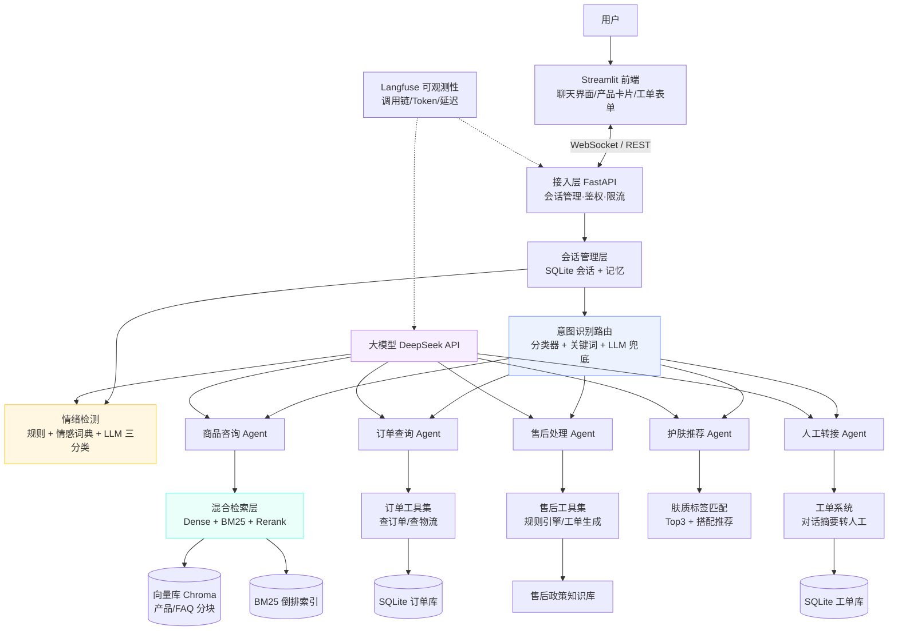
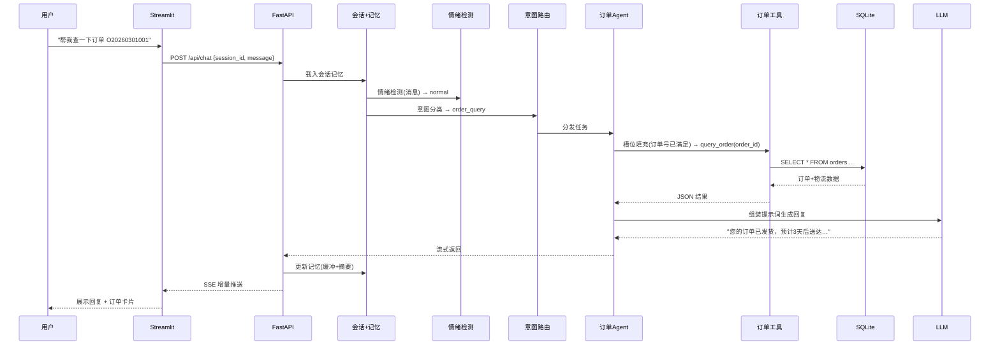
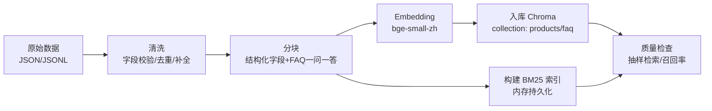

# 美妆电商客服 Agent —— 独一份详细项目规划

> **项目代号**：`yueji-cs-agent`（悦己美妆智能客服）
> **定位**：面向真实客服场景的 RAG + 工具调用 + 多 Agent 路由 + 情绪转人工 全栈智能客服系统
> **参考基线**：`D:\traework\study\AI_Agent\ai-agent-project-plans\ai-agent-project-plans.html`（项目一：美妆电商客服Agent）
> **开发环境**：当前会话所在环境（详见 §2 环境勘察）
> **版本**：v1.0 ｜ **计划周期**：4 周 ｜ **难度**：⭐⭐⭐

---

## 目录

0. [文档说明与"独一份"差异点](#0-文档说明与独一份差异点)
1. [业务背景与问题定义](#1-业务背景与问题定义)
2. [环境勘察结论（本环境定制）](#2-环境勘察结论本环境定制)
3. [总体架构设计](#3-总体架构设计)
4. [数据层设计（项目的核心资产）](#4-数据层设计项目的核心资产)
5. [检索层设计（RAG 核心）](#5-检索层设计rag-核心)
6. [Agent 层设计](#6-agent-层设计)
7. [情绪检测与安全护栏](#7-情绪检测与安全护栏)
8. [API 与前端设计](#8-api-与前端设计)
9. [技术选型清单（含环境适配理由）](#9-技术选型清单含环境适配理由)
10. [评测与验收体系](#10-评测与验收体系)
11. [目录结构（最终版）](#11-目录结构最终版)
12. [实施路线图（4 周 · 含每周验收标准）](#12-实施路线图4-周--含每周验收标准)
13. [风险与应对清单](#13-风险与应对清单)
14. [成本估算](#14-成本估算)
15. [简历亮点与项目描述（更新版）](#15-简历亮点与项目描述更新版)
16. [附录](#16-附录)

---

## 0. 文档说明与"独一份"差异点

本规划以参考文档的项目一为基线，但**不是照抄**。参考文档是"应届生求职版"的概览级方案（3 周、无环境约束、无 schema 级设计、无评测细节），本规划针对**当前实际开发环境**做了重新设计与深化，独特点如下：

| # | 独特设计 | 参考文档 | 本规划 |
|---|---------|---------|--------|
| 1 | **环境定制** | 未考虑运行环境 | 基于 Python 3.14 / 无 GPU / HF 不通 / API 可达 的实测结论做选型（§2） |
| 2 | **Schema 级数据设计** | 仅列目录 | 产品/FAQ/订单/工单/会话 的完整 JSON Schema 与 SQLite DDL（§4） |
| 3 | **工具契约先行** | 只提 Function Calling | 每个工具的 JSON Schema、槽位状态机、错误码契约（§6/附录B） |
| 4 | **检索质量评测** | 无 | 增加召回率/MRR/NDCG 检索评测 + 分块策略对比实验（§5.4、§10） |
| 5 | **幻觉率与 LLM-as-Judge 评测体系** | 笼统"问题解决率" | 定义 7 项指标、100 条 8 类测试集、双轨评测脚本（§10） |
| 6 | **安全护栏** | 无 | Prompt 注入防护、隐私脱敏、敏感词拦截、限流（§7） |
| 7 | **流式输出** | 无 | WebSocket + SSE 流式回复设计（§8） |
| 8 | **成本与风险量化** | 无 | API 成本估算 + 10 项风险应对表（§13、§14） |
| 9 | **版本锁定策略** | LangChain 0.2+ | 针对 LangChain 1.x 现状给出定版方案与迁移注意事项（§9） |
| 10 | **每周 DoD 验收标准** | 仅任务清单 | 每个里程碑有可勾选的验收标准（§12） |

---

## 1. 业务背景与问题定义

### 1.1 业务背景

美妆电商是客服咨询密度最高的行业之一：以某国货美妆品牌旗舰店为例，日均咨询量 5,000–20,000 条，高峰期（大促/上新/夜间）人力严重不足。典型成本结构：

- 人工客服人均月成本 8k–15k 元，培训周期 2–4 周；
- 标准化问题（商品成分、使用方式、订单状态、售后流程）占比约 60–80%，重复回答浪费大量人力；
- 夜间（22:00–次日 9:00）覆盖不足，错过大量成交与售后黄金窗口。

本项目模拟国货美妆品牌 **「悦己 YUEJI 美妆」** 的智能客服系统：用户在 Web 聊天界面咨询商品、查询订单、申请售后、获取护肤建议；Agent 自动处理常规问题，复杂/情绪化问题自动转人工并附带上下文摘要。

### 1.2 目标用户与场景

| 场景 | 用户话术示例 | 期望行为 |
|------|-------------|---------|
| 商品咨询 | "这款面霜适合敏感肌吗？""XX 精华主要成分是什么？" | 基于知识库回答 + 引用溯源 |
| 订单查询 | "查一下我的订单""快递到哪了？" | 调用订单工具返回真实状态与物流 |
| 退换货 | "我要退货""商品破损怎么处理？" | 规则判断 + 表单式引导 + 生成工单 |
| 护肤推荐 | "我是油皮，推荐控油产品""敏感肌用什么水乳？" | 标签匹配 Top3 + 搭配建议 |
| 情绪/升级 | "你们就是骗子！我要投诉曝光！" | 情绪识别 → 致歉 → 转人工（带摘要） |

### 1.3 项目目标（可量化 KPI）

| 指标 | 目标值 | 度量方式 |
|------|-------|---------|
| 问题解决率（4 大场景） | ≥ 75%（100 条测试集） | LLM-as-Judge + 人工抽检 |
| 回答准确率（事实正确性） | ≥ 85% | 引用溯源可校验 |
| 幻觉率（无依据断言占比） | ≤ 5% | 评测脚本逐条标注 |
| 首次响应时间（TTFT） | < 3 秒 | 本地计时（网络波动容忍 ±1s） |
| 情绪识别准确率 | ≥ 80% | 30 条情绪标注集 |
| 意图路由准确率 | ≥ 85% | 100 条测试集 |
| 并发能力 | 50+ 并发对话 | locust 压测（FastAPI 异步） |

### 1.4 项目边界（明确不做）

- ❌ 不做真实支付/物流对接（用模拟数据 + 模拟接口）；
- ❌ 不做多轮复杂推理（如跨订单汇总分析）；
- ❌ 不做语音/多模态客服（后续可扩展）；
- ✅ 聚焦"工程完整 + 效果可量化"，这是本项目区别于玩具 Demo 的核心。

---

## 2. 环境勘察结论（本环境定制）

> 以下为开发前对当前环境实测得出的结论，**本规划所有选型以此为依据**。

### 2.1 环境事实

| 项目 | 实测结果 | 对选型的影响 |
|------|---------|-------------|
| Python | **3.14.4**（很新） | 个别依赖可能缺 3.14 wheel → 需要 venv + 版本验证（§9.3 风险预案） |
| pip | 25.1.1 | 正常 |
| Node.js | v24.19.0 | 前端如需可复用；本项目前端用 Streamlit（纯 Python） |
| 内存 | 7.8GB 总 / ~3.4GB 可用 | 大模型本地推理不可行；本地 embedding/rerank 须用小模型 |
| GPU | **无** | embedding/rerank 全部走 CPU，模型体积 ≤ 1.5GB 且推理延迟可控 |
| 磁盘 | 895GB 可用 | 数据与模型存储无压力 |
| PyPI | ✅ 可达（200） | 依赖可正常安装 |
| api.deepseek.com | ✅ 可达（401=需鉴权） | DeepSeek 作为主 LLM，需要 API Key |
| dashscope（阿里云百炼） | ✅ 可达 | 备选 LLM / API 版 embedding |
| huggingface.co | ❌ **不通**（超时） | 本地模型改从 ModelScope / hf-mirror 下载，或走 API embedding |

### 2.2 由环境推导出的关键决策

1. **LLM 走 API，不做本地推理**：DeepSeek `deepseek-chat`（OpenAI 兼容接口，LangChain 直接接入）；
2. **Embedding 首选轻量本地模型**：`BAAI/bge-small-zh-v1.5`（约 100MB，CPU 推理 <100ms/次），从 **ModelScope 镜像**下载；兜底方案为 DashScope API embedding（`text-embedding-v3`）；
3. **Reranker 用 base 级**：`BAAI/bge-reranker-base`（约 1.1GB，CPU 上对 Top-20 打分约 200–500ms，可接受）；若延迟超标则降级为 RRF 分数融合（§5.2）；
4. **向量库用 Chroma**（本地进程内、零运维、对 Python 3.14 兼容性好），接口层抽象以便日后平滑迁移 Milvus 集群版；
5. **开发期全程 venv 隔离**，`requirements.txt` 锁定主版本，Python 3.14 不兼容时降级方案见 §9.3。

---

## 3. 总体架构设计

### 3.1 架构图



### 3.2 分层职责

| 层级 | 模块 | 职责 | 核心技术 |
|------|------|------|---------|
| 接入层 | FastAPI + Streamlit | 用户交互、会话、WebSocket 流式、限流 | FastAPI、WebSocket、JWT(简化) |
| 路由层 | 意图识别 + 情绪检测 | 分发意图、决定转人工 | 关键词 + 少样本分类 + LLM 兜底 |
| Agent 层 | 5 个专项 Agent | 场景对话、工具调用、决策 | LangChain Agent、Function Calling |
| 能力层 | RAG + 工具集 + 规则引擎 | 检索、订单查询、售后判定 | Chroma、BM25、Rerank、SQL |
| 数据层 | 向量库 + 关系库 + 文件 | 产品/FAQ/订单/政策/工单 | Chroma、SQLite、JSON |
| 可观测层 | Langfuse | 调用链、Token 消耗、延迟 | Langfuse SDK |

### 3.3 一次完整对话时序



### 3.4 关键设计决策（ADR 风格）

| 决策点 | 选择 | 理由 | 代价/备选 |
|--------|------|------|----------|
| 单 Agent + 路由 vs 真多 Agent | **LangGraph StateGraph（Supervisor-Worker）**，路由 Supervisor + 5 个 Worker Agent | 场景边界清晰、图执行可追踪、并发安全 | ✅ 已于 v2.0 落地（原为意图路由分发，后升级为图编排） |
| 检索策略 | **混合检索（Dense+BM25）+ Rerank** | 单一向量检索对专有名词（成分名）召回差，BM25 互补 | 实现量 +30%，用 RRF 融合控制复杂度 |
| 会话状态 | SQLite 持久化 + 内存缓存 | 可重启恢复、便于评测复现 | 并发瓶颈通过连接池解决 |
| 输出方式 | 流式（SSE）+ 非流式双模式 | 感知延迟低，且评测脚本用非流式更稳定 | 两种模式共用同一生成函数 |
| 转人工 | 情绪检测前置 + 策略引擎 | 明确可解释的转人工条件，便于评测"该转才转" | 规则阈值需调参（§7） |

---

## 4. 数据层设计（项目的核心资产）

> 数据是本项目的"原材料"，质量直接决定效果。先定 Schema 再写代码。

### 4.1 产品知识库（JSON，30–50 款）

```json
{
  "product_id": "P001",
  "name": "烟酰胺焕亮精华液",
  "brand": "悦己 YUEJI",
  "category": "精华",
  "spec": "30ml",
  "price": 129.00,
  "original_price": 159.00,
  "ingredients": ["烟酰胺(5%)", "泛醇", "透明质酸钠"],
  "efficacy": ["提亮肤色", "淡化痘印", "改善暗沉"],
  "skin_types": ["油性", "混合性"],
  "skin_issues": ["暗沉", "痘印"],
  "age_groups": ["18-25", "26-35"],
  "usage": "早晚洁面爽肤后取3-4滴，均匀涂抹面部并轻拍至吸收",
  "cautions": "烟酰胺不耐受者请先局部测试；白天使用需防晒",
  "shelf_life": "36个月",
  "stock": 328,
  "monthly_sales": 15600,
  "rating": 4.8,
  "tags": ["烟酰胺", "美白", "平价"],
  "faq_ids": ["F101", "F102"]
}
```

**字段说明**：`ingredients`/`efficacy`/`skin_types`/`skin_issues`/`age_groups`/`tags` 均为标签化字段——这是护肤推荐 Agent 做标签匹配、检索层做结构化过滤的基础。数据生成方式：以真实产品为灵感人工撰写（合成数据，避免版权问题），注意字段完整率 ≥ 95%。

### 4.2 FAQ 知识库（JSONL，150+ 条）

```json
{"faq_id": "F101", "category": "商品-使用", "question": "烟酰胺需要建立耐受吗？", "answer": "需要。建议第一周隔天使用…", "source": "P001", "aliases": ["耐受", "刺痛", "泛红怎么办"]}
{"faq_id": "F201", "category": "售后-政策", "question": "支持七天无理由退换吗？", "answer": "支持。签收后7天内（含）可无理由退换…", "source": "policy", "aliases": ["退货", "无理由"]}
```

每条 FAQ 带 `aliases`（别名/问法变体）——显著提升召回率，是检索质量的关键细节。

### 4.3 订单库（SQLite DDL，20 条模拟订单）

```sql
CREATE TABLE IF NOT EXISTS orders (
  order_id   TEXT PRIMARY KEY,              -- O20260301001
  user_id    TEXT NOT NULL,                 -- 与会话用户关联
  phone      TEXT NOT NULL,                 -- 尾号脱敏展示
  status     TEXT NOT NULL CHECK (status IN
             ('待付款','待发货','已发货','已完成','已取消','退款中')),
  total_amount REAL NOT NULL,
  created_at TEXT NOT NULL,
  items      TEXT NOT NULL,                 -- JSON: [{product_id, name, qty, price}]
  tracking   TEXT,                          -- JSON: {company, tracking_no, events:[{time,desc}]}
  aftersale_status TEXT DEFAULT NULL
);

CREATE INDEX idx_orders_user ON orders(user_id);
CREATE INDEX idx_orders_phone ON orders(phone);
```

**查询规则**：订单号 + 手机号尾号双重校验（防越权查询他人订单）——安全细节。

### 4.4 售后政策知识库（JSON，10 条政策）

```json
{"policy_id": "POL-1", "type": "七天无理由", "rules": {"within_days": 7, "resaleable": true, "unworn": true}, "process": "APP提交→审核→寄回→验货→退款", "duration": "审核1-3个工作日，退款原路返回3-7个工作日"}
{"policy_id": "POL-2", "type": "质量问题", "rules": {"quality_issue": true, "evidence_required": ["照片", "视频"]}, "process": "提交凭证→人工复核→补发/退款", "duration": "复核24小时内"}
{"policy_id": "POL-3", "type": "错发漏发", "rules": {"mistake": true}, "process": "核实→补发（顺丰加急）", "duration": "当天处理"}
```

### 4.5 会话表（SQLite DDL）

```sql
CREATE TABLE IF NOT EXISTS sessions (
  session_id TEXT PRIMARY KEY,
  user_id    TEXT,
  created_at TEXT NOT NULL,
  updated_at TEXT NOT NULL,
  status     TEXT DEFAULT 'active',         -- active | transferred | closed
  emotion    TEXT DEFAULT 'normal',         -- 最近情绪等级
  summary    TEXT,                          -- 摘要记忆（长会话压缩）
  meta       TEXT                           -- JSON: 上下文、已填槽位、意图轨迹
);

CREATE TABLE IF NOT EXISTS messages (
  id INTEGER PRIMARY KEY AUTOINCREMENT,
  session_id TEXT NOT NULL,
  role TEXT NOT NULL CHECK (role IN ('user','assistant','system','tool')),
  content TEXT NOT NULL,
  ts TEXT NOT NULL
);

CREATE TABLE IF NOT EXISTS tickets (
  ticket_id TEXT PRIMARY KEY,               -- AS20260315-0001
  session_id TEXT,
  order_id TEXT,
  user_id TEXT,
  type TEXT NOT NULL,                       -- 退货退款|换货|仅退款|补发
  reason TEXT,
  description TEXT,
  evidence TEXT,                            -- JSON 数组
  condition_check TEXT,                     -- JSON: 规则引擎判定结果
  status TEXT DEFAULT '待审核',
  emotion TEXT,
  summary TEXT,                             -- 转人工摘要
  created_at TEXT NOT NULL
);
```

### 4.6 数据量规划

| 数据 | 规模 | 来源 | 质检要求 |
|------|------|------|---------|
| 产品 | 40 款（4 个品类 × 10） | 人工撰写合成数据 | 字段完整率 ≥95%，成分/肤质标签准确 |
| FAQ | 160 条（商品/订单/售后/物流/活动） | 人工撰写 + 真实客服话术改编 | 每条含 aliases ≥2 个 |
| 订单 | 20 条（覆盖 6 种状态） | 脚本生成 | 每种状态 ≥2 条，含物流事件 |
| 售后政策 | 10 条（3 大类 × 细则） | 参考主流电商规则改写 | 规则字段可直接被引擎消费 |
| 测试集 | 100 条（§10） | 人工标注 | 覆盖 8 类场景 |

### 4.7 知识库构建流水线（Ingestion Pipeline）



**分块策略**（本项目核心实验点）：

- 产品数据：**结构化分块**——每款产品生成 1 个"主条目" + 按字段生成检索友好文本（如 `成分功效块`、`使用方法块`、`注意事项块`），不按字符硬切，避免切碎成分表；
- FAQ：**一问一答成块**，块 = question + answer + aliases；
- 售后政策：按政策类型成块，规则字段单独存 JSON 供规则引擎直读（不进向量库）。

**质量检查**：入库后跑 10 条预置查询，人工核对 Top-5 召回是否合理，不达标则调整分块/字段权重。

---

## 5. 检索层设计（RAG 核心）

### 5.1 混合检索流程

```
用户提问（如"烟酰胺精华敏感肌能用吗"）
  ├─ 查询改写（LLM 可选）：抽取实体关键词 → 增加检索用查询
  ├─ Dense：query embedding → Chroma topK=20
  ├─ BM25：关键词 → rank-bm25 topK=20
  ├─ 融合：RRF 公式 score = Σ 1/(k + rank)，k=60 → 取 Top10
  ├─ Rerank：bge-reranker-base 对 Top10 打分 → 取 Top5
  └─ 阈值判断：max_score < 0.3 → 判定"无可信答案"走澄清/拒答流程
```

### 5.2 降级策略（环境约束下的取舍）

| 情况 | 降级方案 |
|------|---------|
| bge-reranker 在 CPU 上延迟 >1s | 跳过 Rerank，直接用 RRF 融合结果 Top5（牺牲少量精度换延迟） |
| HF 下载失败且 ModelScope 也不通 | Embedding 切换为 DashScope API（`text-embedding-v3`），代价是每次检索 +1 次网络调用 |
| 检索总延迟 >1.5s | BM25 与 Dense 并行执行（asyncio.gather） |

### 5.3 引用溯源与幻觉抑制

- **上下文打包格式**：每条检索结果带 `[来源: 产品P001 原文片段]` 标记，提示词强制要求"引用来源标注"；
- **引用协议**：LLM 回复中每个事实断言后附 `〔来源: 产品名/FAQ编号〕`；前端渲染为可点击小标签；
- **拒答协议**：当检索 `max_score < 阈值` 或与问题明显无关时，LLM 输出模板化话术："这个问题我需要确认一下，已为您转接人工/建议咨询具体产品名称"——**严禁编造**；
- **评测联动**：幻觉率指标即检测"无来源标注的断言"占比（§10.2）。

### 5.4 检索质量评测

在整体评测之前，先单独验证检索层：

| 指标 | 定义 | 目标 |
|------|------|------|
| 召回率@10 | 相关文档是否出现在 Top10 | ≥ 85% |
| MRR@10 | 首个相关文档的排名倒数均值 | ≥ 0.7 |
| NDCG@5 | 相关度加权的排序质量 | ≥ 0.75 |

方法：构建 30 条"问题→相关产品/FAQ"标注对，脚本对比 Dense-only / BM25-only / 混合 三种策略，输出对比表，作为方案定版的量化依据（写入开发笔记）。

---

## 6. Agent 层设计

### 6.1 路由层：意图识别

**意图 Schema**（8 类）：

```json
{"intent": "product_consult | order_query | aftersale | skincare_recommend | logistics | policy | chitchat | transfer_human"}
```

**三级识别策略**（成本从低到高）：

1. **关键词/正则**：命中强信号词（"退货""订单号""快递"）直接判定——零成本、快；
2. **少样本分类**：规则未命中时，用轻量分类（TF-IDF + LogisticRegression 或 LLM 一次性多分类），输入为意图候选 + 关键词命中数；
3. **LLM 兜底**：前两级置信度都低时调用 LLM 分类（一次调用，复用同一请求上下文）。

**混淆场景处理**："我这个精华还没发货" 同时含商品与订单信号 → 规则优先级表（订单信号 > 商品信号），并允许 Agent 间**接力**（路由后仍可在回复中携带检索结果）。

### 6.2 商品咨询 Agent

- **输入**：用户消息 + 检索结果 Top5 + 会话记忆；
- **System Prompt 骨架**（全文见附录 A.1）：
  ```
  你是"悦己美妆"客服 Agent「小悦」。职责：基于提供的知识片段回答商品问题。
  规则：1) 只依据检索片段作答，必须标注来源〔来源: 产品/FAQ〕；
        2) 片段不足以回答时，说明并追问具体产品/问题，禁止编造；
        3) 涉及价格/库存/活动以片段为准；
        4) 涉及功效宣称，使用"有助于/可改善"等合规表述；
        5) 用户提及敏感肌/孕妇等特殊人群，必须提示"建议先做皮肤测试/遵医嘱"。
  ```
- **澄清策略**："这个多少钱" → 反问"请问您指的是哪款产品？"（结合记忆：若上一轮提到某产品则直接回答该产品）；
- **工具**：`search_product`（按名称/标签查产品详情，用于补全检索）。

### 6.3 订单查询 Agent（槽位填充状态机）

```
意图: order_query
槽位: order_id(必需) | phone_tail(必需, 校验用)
状态机: [缺order_id] → 追问"请提供订单号"
        [缺phone_tail] → 追问"请提供下单手机号后四位"
        [齐备] → 调用 query_order(order_id, phone_tail)
                 → 校验通过: 格式化输出(状态/商品/金额/物流)
                 → 校验失败: "未找到匹配订单，请核对订单号"
```

**工具契约**（Function Calling JSON Schema 见附录 B.1）：

```
query_order(order_id: str, phone_tail: str) -> {
  "found": true,
  "order": {order_id, status, items, total_amount, tracking: {company, events[]}}
}
```

**演示价值**：工具调用时机由模型自主决策，可讲解"模型何时选择调用工具、参数如何填充、错误如何回退"。

### 6.4 售后处理 Agent（规则引擎 + 表单式多轮）

**流程**：

```
意图: aftersale
步骤1: 判断售后类型（退货退款/换货/仅退款/补发）——多选一提问
步骤2: 规则引擎判定资格：
       - 7天无理由: within_days<=7 && 未使用 && 包装完好
       - 质量问题: 需凭证（图片/视频）
       - 错发漏发: 需核对订单 items 与实际收货
       任一条件不满足 → 给出依据 + 替代方案（如"可申请换货"）
步骤3: 表单式收集: 订单号 → 问题描述 → 凭证（提示上传/填写）
步骤4: 生成工单（附录 B.2 契约）→ 返回工单号 + 处理时效
```

**表单状态机**与订单 Agent 复用同一套槽位管理组件（`slots.py`），体现工程复用。

### 6.5 护肤推荐 Agent（标签匹配）

**标签体系**：肤质 `{干性, 油性, 混合性, 敏感性, 中性}` × 肌肤问题 `{痘痘, 敏感泛红, 暗沉, 干燥起皮, 毛孔粗大, 细纹, 黑头, 出油}` × 年龄 `{<18, 18-25, 26-35, 36+}`

**匹配算法**：

```
1. 从用户描述提取标签（LLM 抽取 + 词典兜底），如"我是油皮，T区出油严重还有痘印"
   → skin_types=[油性] skin_issues=[出油, 痘印] age=18-25
2. 产品打分: score = 0.5*肤质命中 + 0.3*问题命中 + 0.2*年龄命中（同肤质再叠加销量排序）
3. 取 Top3 输出推荐卡: 产品 + 理由（引用标签依据）+ 价格
4. 搭配建议: 按"洁面→水→乳/霜"链路推荐同系列组合（从搭配表查询）
5. 特殊人群提示: 敏感肌/孕妇 → 追加温和提示
```

**与商品咨询的边界**：推荐 Agent 输出"为什么推荐"（标签推理），商品 Agent 输出"是什么"（知识检索），路由层按意图分发。

### 6.6 人工转接 Agent

- **触发**：情绪引擎判定转人工（§7.1）或用户明确要求"转人工/找客服"；
- **流程**：致歉话术（模板 + 原因）→ 自动生成工单（含对话摘要、用户问题、情绪等级）→ 返回"已为您转接，工单号 XXX，人工客服将在 X 分钟内接入"；
- **平滑过渡设计**：先共情再告知，避免"被甩锅"感；转接后会话状态置 `transferred`，前端展示"人工客服"标识。

### 6.7 会话记忆设计

| 层级 | 实现 | 用途 |
|------|------|------|
| 短期缓冲 | 最近 10 轮完整消息（窗口记忆） | 多轮上下文（澄清、接力） |
| 中期摘要 | 超过窗口的对话压缩为摘要（LLM 摘要，存 sessions.summary） | 长会话不丢关键信息 |
| 结构化记忆 | sessions.meta：已填槽位、当前意图、最近产品 | 状态机与澄清策略复用 |

记忆组装进每次 LLM 调用的 prompt 前缀，控制总 token（摘要 + 窗口 ≤ 4k tokens）。

---

## 7. 情绪检测与安全护栏

### 7.1 情绪检测（三级）

| 等级 | 定义 | 示例 |
|------|------|------|
| normal | 正常咨询 | "请问这款面膜怎么用？" |
| negative | 不满/失望 | "等了三天还没发货，太慢了" |
| angry | 愤怒/投诉/索赔 | "你们是骗子！我要投诉315曝光你们！" |

**三级检测链路**（成本递增）：

1. **情感词典 + 规则**：负面词表（"差评、垃圾、骗、投诉、曝光、315、失望、气死、退钱"）+ 强信号（连续感叹号/问号 ≥3、全大写/重复字）；命中即定级；
2. **LLM 三分类兜底**：规则未命中时由 LLM 判定（复用路由调用，无额外请求）；
3. **会话级平滑**：`emotion = max(当前消息等级, 上一轮等级 - 1)`，防止单次误判造成情绪突变。

**转人工策略**：

```
连续 2 轮 negative  OR  1 轮 angry  OR  关键词命中{投诉,315,曝光,律师,媒体}
→ 触发 transfer_human
```

**评测**：30 条情绪标注集验证准确率 ≥ 80%（§10）。

### 7.2 安全护栏

| 风险 | 防护措施 |
|------|---------|
| Prompt 注入（"忽略以上指令…"） | 系统提示词声明边界 + 输入检测规则（检测"忽略/越狱/扮演系统"等模式）+ 工具调用白名单（模型只能调用已注册工具，无法输出任意代码） |
| 越权查询他人订单 | 订单查询强制"订单号 + 手机尾号"双校验；对话中不含用户手机号时拒绝输出 |
| 隐私泄露 | 日志与 Langfuse 中手机号/姓名脱敏（正则替换 `\d{11}` → `138****0000`）；工单仅存必要字段 |
| 敏感内容（涉黄暴/违法） | 敏感词表拦截 → 模板话术拒绝 + 标记会话 |
| 滥用/刷接口 | FastAPI 限流（按 session_id + IP，如 20 req/min）+ 单会话长度上限（200 轮） |
| 幻觉/编造 | §5.3 引用协议 + 拒答协议 + 幻觉率评测门禁（≥5% 不发布） |

---

## 8. API 与前端设计

### 8.1 REST 端点

| 方法 | 路径 | 说明 | 请求/响应要点 |
|------|------|------|--------------|
| POST | `/api/session` | 创建会话 | `{session_id}` |
| POST | `/api/chat` | 非流式对话 | `{session_id, message}` → `{reply, sources[], emotion, intent, action?}` |
| POST | `/api/chat/stream` | 流式对话（SSE） | `data: {delta: "..."}` 增量 + 结束帧含 sources |
| GET | `/api/order/{order_id}` | 订单详情（调试用） | 校验 phone_tail |
| POST | `/api/aftersale/ticket` | 创建工单 | 契约见附录 B.2 |
| GET | `/api/session/{id}/history` | 会话历史 | 前端恢复上下文 |
| GET | `/health` | 健康检查 | Docker 探活 |

### 8.2 WebSocket（可选增强）

`/ws/chat`：双向流式；前端即时展示打字机效果。实现成本低（FastAPI 原生支持），作为 W4 加分项。

### 8.3 Streamlit 前端设计

| 区域 | 组件 | 说明 |
|------|------|------|
| 侧边栏 | 会话列表 + 新会话按钮 | 多会话切换 |
| 主聊天区 | `st.chat_message` 气泡 | 用户/助手区分；助手消息内嵌来源标签（`st.popover`/链接） |
| 订单卡片 | `st.status` / 表格 | 订单 Agent 输出结构化订单信息时渲染为卡片 |
| 工单表单 | 表单 + 文件上传（可选） | 售后收集凭证 |
| 推荐卡片 | 三列产品卡（名称/价格/理由） | 护肤推荐输出渲染 |
| 状态栏 | 情绪徽章 + 转人工标识 | 展示 emotion 与 transferred 状态 |
| 调试面板（隐藏开关） | 展示检索来源、token、延迟 | 演示/自测用 |

前端原则：**一切结构化输出都有对应渲染组件**（不是纯文本），这是 Demo 质感的关键。

---

## 9. 技术选型清单（含环境适配理由）

### 9.1 选型表

| 类别 | 选定 | 理由（含环境适配） | 备选 |
|------|------|-------------------|------|
| 大模型 | **DeepSeek `deepseek-chat`**（OpenAI 兼容） | 中文好、便宜、API 实测可达；Function Calling 完善 | Qwen2.5（DashScope）、GLM-4 |
| Agent 框架 | **LangChain 1.x**（`langchain` + `langchain-openai`） | 生态最成熟、工具封装完善；参考文档同栈 | LlamaIndex、CrewAI |
| 向量库 | **Chroma**（本地进程内） | Python 3.14 兼容性好、零运维；接口层抽象可平滑迁移 Milvus 集群版 | Milvus Lite、pgvector |
| Embedding | **`BAAI/bge-small-zh-v1.5`**（本地 CPU，~100MB，ModelScope 下载） | HF 不通；小模型 CPU 推理 <100ms；中文效果领先同量级 | API: Qwen text-embedding-v3；bge-large-zh |
| Rerank | **`BAAI/bge-reranker-base`**（~1.1GB，CPU） | Top-10 打分可接受；质量明显优于纯融合 | RRF 降级；bge-reranker-v2-m3 |
| BM25 | **rank-bm25**（内存倒排） | 语料小（~200 块），内存索引足够 | Elasticsearch（杀鸡用牛刀） |
| 后端 | **FastAPI + uvicorn** | 异步 + WebSocket + 流式原生支持 | Flask（同步，流式麻烦） |
| 前端 | **Streamlit 1.62** | 纯 Python、聊天 UI 快、生态组件足 | Gradio、Vue+Element |
| 数据库 | **SQLite**（内置 + 连接池） | 单机足够，零运维；`aiosqlite` 异步访问 | PostgreSQL（部署期可迁移） |
| 可观测 | **Langfuse**（自托管或云） | 调用链/Token/延迟可视化，简历加分项 | LangSmith（付费） |
| 部署 | **Docker + docker-compose** | 一键启动；演示/交付标准化 | systemd 直接跑 |
| 压测 | **locust**（可选） | 验证 50+ 并发目标 | 简单 asyncio 脚本 |

### 9.2 requirements.txt（草案，W1 定版）

```text
# LLM / Agent
langchain>=1.0,<2
langchain-openai>=1.0
# Web
fastapi>=0.140
uvicorn[standard]>=0.30
streamlit>=1.50
websockets>=13
# 检索
chromadb>=1.0
rank-bm25>=0.2
sentence-transformers>=5.0        # 本地 embedding + rerank
# 数据
sqlalchemy>=2.0
aiosqlite>=0.20
pandas>=2.2
# 可观测
langfuse>=4.0
# 工具
python-dotenv>=1.0
pydantic>=2.7
httpx>=0.27
# 评测
scikit-learn>=1.5                 # 意图分类器/评测指标
# 测试
pytest>=8.0
locust>=2.30                      # 可选压测
```

### 9.3 版本与兼容性预案（Python 3.14）

1. **W1 第 0 天动作**：创建 venv → `pip install -r requirements.txt` → 逐个 import 冒烟测试；
2. 若个别包无 3.14 wheel（如 `sentence-transformers` 底层 `torch`）：安装 `uv` 并创建 Python 3.12 虚拟环境（`uv python install 3.12`），代码不变仅换解释器；
3. **LangChain 版本注意**：多数中文教程基于 0.2/0.3，1.x 有 API 变化（`langchain.chains` 收敛、工具统一 `@tool` 装饰器、`ChatOpenAI` 在 `langchain-openai` 包）。定版策略：**优先 1.x + 官方迁移文档**；若学习成本过高，可锁 `langchain==0.3.x` 对齐教程（二选一，写入 README 决策记录）。

---

## 10. 评测与验收体系

### 10.1 指标定义

| 指标 | 定义 | 目标 | 评测方式 |
|------|------|------|---------|
| 问题解决率 | 测试集任务达成比例 | ≥75% | LLM-as-Judge + 人工抽检 20% |
| 回答准确率 | 事实断言正确比例 | ≥85% | 引用溯源比对 + 人工 |
| 幻觉率 | 无依据断言占比 | ≤5% | 逐条标注 |
| 意图路由准确率 | 分类正确/总数 | ≥85% | 测试集比对 |
| 情绪识别准确率 | 三级情绪判定正确率 | ≥80% | 30 条情绪标注集 |
| TTFT / 完整响应 | 首 token / 完整回复耗时 | <3s / <8s | 本地计时 |
| 转人工 Precision/Recall | 该转的转、不该转的不转 | P≥0.85 R≥0.9 | 测试集比对 |

### 10.2 测试集设计（100 条，JSON）

```json
{
  "id": "T-001",
  "category": "product_consult",
  "session": [{"role": "user", "content": "烟酰胺精华敏感肌能用吗？"}],
  "expected": {"intent": "product_consult", "has_sources": true, "contains": ["敏感肌", "测试"]},
  "grade": "auto"
}
```

| 类别 | 条数 | 覆盖点 |
|------|------|--------|
| 商品咨询 | 20 | 成分/肤质/价格/使用方法/引用溯源 |
| 订单查询 | 15 | 正常/缺槽位追问/无此订单/物流 |
| 售后 | 15 | 三种售后类型/不符合条件/凭证缺失 |
| 护肤推荐 | 15 | 各肤质/搭配推荐/特殊人群提示 |
| 情绪与转人工 | 10 | 三级情绪/触发转接/致歉话术 |
| 模糊澄清 | 10 | "多少钱"/"适合我吗"等无指代问题 |
| 拒答与越权 | 10 | 无依据问题/查他人订单/诱导系统指令 |
| 多轮上下文 | 5 | 跨轮指代（"那款""刚才说的"） |

### 10.3 评测脚本设计（双轨）

```
eval/evaluate.py
├─ 自动轨（无 LLM）：意图准确率、情绪准确率、工具调用参数正确性（比对 expected）
├─ LLM-as-Judge 轨：对 answer 按 rubric（完整性/正确性/来源标注/礼貌度）打 1-5 分
│    规则：来源标注缺失或与检索片段矛盾 → 直接记幻觉/不通过
└─ 人工抽检：随机 20% 由开发者复核，与 Judge 结果比对防偏置
输出：eval/reports/YYYYMMDD_report.json + markdown 汇总表（每次评测归档，展示调优曲线）
```

### 10.4 发布门槛（Release Gate）

```
问题解决率≥75% AND 幻觉率≤5% AND 路由准确率≥85%
AND TTFT<3s(中位数) AND 转人工 P/R 达标 AND 压测 50 并发无 5xx
→ 打 tag v1.0，写 README 指标截图
```

---

## 11. 目录结构（最终版）

```text
yueji-cs-agent/
├── README.md                     # 项目介绍 + 架构图 + 快速开始 + 指标截图
├── requirements.txt
├── .env.example                  # DEEPSEEK_API_KEY / LANGFUSE_* 等
├── Dockerfile
├── docker-compose.yml            # api + web 两服务
├── .gitignore
├── config/
│   └── settings.py               # 集中配置（模型名/检索参数/阈值/路径）
├── data/
│   ├── raw/                      # 原始合成数据（产品/FAQ/政策 JSON）
│   ├── processed/                # 清洗分块后的检索语料
│   └── db/                       # SQLite 文件（订单/会话/工单）
├── scripts/
│   ├── ingest.py                 # 知识库构建流水线
│   ├── gen_orders.py             # 模拟订单生成器
│   └── check_env.py              # W1 环境自检（依赖/模型下载/API连通）
├── src/
│   ├── api/
│   │   ├── main.py               # FastAPI 入口
│   │   ├── routes.py             # 端点实现（含 SSE 流式）
│   │   └── deps.py               # 会话/限流依赖
│   ├── agents/
│   │   ├── base_agent.py         # 基础 Agent（prompt 组装/记忆注入/工具注册）
│   │   ├── router.py             # 意图路由（三级策略）
│   │   ├── product_agent.py
│   │   ├── order_agent.py        # 含槽位状态机
│   │   ├── aftersale_agent.py
│   │   ├── skincare_agent.py
│   │   └── human_agent.py
│   ├── rag/
│   │   ├── embedder.py           # 本地/API embedding 适配
│   │   ├── retriever.py          # 混合检索 + RRF 融合
│   │   ├── reranker.py           # bge-reranker（可禁用）
│   │   └── vector_store.py       # Chroma 封装（预留 Milvus 接口）
│   ├── tools/
│   │   ├── order_tools.py        # query_order / query_logistics
│   │   ├── aftersale_tools.py    # check_policy / create_ticket
│   │   ├── product_tools.py      # search_product
│   │   └── registry.py           # 工具注册 + JSON Schema 导出
│   ├── memory/
│   │   ├── buffer.py             # 窗口记忆
│   │   └── summary.py            # 摘要压缩
│   ├── emotion/
│   │   └── detector.py           # 词典+规则+LLM 三级
│   ├── session/
│   │   ├── store.py              # SQLite 会话持久化
│   │   └── slots.py              # 槽位状态机（订单/售后复用）
│   └── utils/
│       ├── security.py           # 脱敏/注入检测/敏感词
│       └── tracing.py            # Langfuse 埋点
├── frontend/
│   └── app.py                    # Streamlit 界面
├── eval/
│   ├── test_set.json             # 100 条测试集
│   ├── emotion_set.json          # 30 条情绪集
│   ├── retrieval_set.json        # 30 条检索标注集
│   ├── evaluate.py               # 双轨评测脚本
│   └── reports/                  # 评测报告归档
├── tests/                        # pytest 单测（路由/槽位/规则引擎/安全）
│   ├── test_router.py
│   ├── test_slots.py
│   ├── test_aftersale_rules.py
│   └── test_security.py
└── docs/
    ├── 项目规划.md               # 本文档
    ├── 开发笔记.md               # 决策记录/调优过程/指标曲线
    └── 部署手册.md
```

---

## 12. 实施路线图（4 周 · 含每周验收标准）

> 相对参考文档的 3 周增加 1 周缓冲，用于环境适配（Python 3.14、模型下载）与检索评测实验。

### M0 准备（第 0 天，半天）✅ 已完成

- [x] 获取 DeepSeek API Key 并验证连通（实测往返 ~1.1s）
- [x] 创建项目骨架（git init、目录、requirements、.env.example）
- [x] 环境自检通过：依赖全装（Python 3.14）、Embedding 用 Ollama bge-m3（本机已装，无需下载）、DeepSeek 连通
- [x] 补充发现：本机 Ollama 提供 bge-m3 与 qwen2.5（兜底 LLM），技术栈据此微调（见开发笔记 ADR-002）

### W1 环境与数据（第 1 周）

**目标**：环境全通 + 数据入库 + 检索 Demo 可跑。

| 任务 | 交付物 |
|------|--------|
| venv + requirements 安装 + 冒烟测试 | `check_env.py` 全绿 |
| 撰写 40 款产品 / 160 条 FAQ / 10 条政策（合成数据） | `data/raw/*.json` |
| 模拟订单生成器（20 条，6 状态全覆盖） | `scripts/gen_orders.py` → SQLite |
| Ingestion 流水线（清洗→分块→embedding→入库） | `scripts/ingest.py`，Chroma collections |
| 混合检索 + RRF + Rerank 实现 | `src/rag/*` |
| 检索质量评测（30 条标注集，三策略对比） | `eval/reports/w1_retrieval.md` |

**验收标准（DoD）**：
- [ ] `check_env.py` 全绿（依赖、模型、API）；
- [ ] 数据字段完整率 ≥95%，入库后抽样检索 10 条预置查询人工核对 Top5 合理；
- [ ] 检索评测报告产出，混合策略 召回率@10 ≥85%、MRR@10 ≥0.7（不达标则调分块/融合参数）；
- [ ] 本地起服务后 `curl /health` 200。

### W2 检索问答 + 商品咨询 Agent（第 2 周）

**目标**：商品咨询场景达到可用状态（含引用溯源与拒答）。

| 任务 | 交付物 |
|------|--------|
| 会话/消息 SQLite 表 + 存取模块 | `src/session/store.py` |
| 记忆模块（窗口 + 摘要） | `src/memory/*` |
| 商品咨询 Agent + 澄清策略 | `src/agents/product_agent.py` |
| 引用溯源与拒答协议落地 | prompt 模板 + 输出解析 |
| 简易聊天界面（Streamlit 骨架） | `frontend/app.py` 可对话 |

**验收标准（DoD）**：
- [ ] 商品咨询 20 条测试用例：解决率 ≥80%（场景内），全部回答带来源标注；
- [ ] "这个多少钱"类模糊问题正确触发澄清；
- [ ] 无知识依据问题正确拒答（不编造）；
- [ ] 会话中断/重启后可恢复历史。

### W3 工具调用 + 多 Agent 路由（第 3 周）

**目标**：订单/售后/推荐/转人工 4 个 Agent 全通 + 路由 + 情绪。

| 任务 | 交付物 |
|------|--------|
| 订单工具 + 槽位状态机 + 订单 Agent | `src/tools/order_tools.py`、`order_agent.py` |
| 售后规则引擎 + 工单工具 + 售后 Agent | `aftersale_tools.py`、`aftersale_agent.py` |
| 标签体系 + 匹配算法 + 推荐 Agent | `skincare_agent.py` |
| 情绪检测三级 + 转人工 Agent + 工单生成 | `emotion/detector.py`、`human_agent.py` |
| 意图路由（三级策略） | `agents/router.py` |
| 安全模块（脱敏/注入检测/限流） | `utils/security.py` |

**验收标准（DoD）**：
- [ ] 订单查询 15 条用例全通（含缺槽位追问、无订单回退）；
- [ ] 售后 15 条用例全通（含不符合条件时的替代方案）；
- [ ] 推荐 15 条用例：标签提取正确、Top3 合理、含搭配建议；
- [ ] 情绪 30 条标注集准确率 ≥80%，转人工触发条件符合预期；
- [ ] 意图路由准确率 ≥85%（100 条测试集全场景跑通）；
- [ ] 注入攻击样例被拦截，日志无明文手机号。

### W4 前端、评测、部署、打磨（第 4 周）

**目标**：完整工程化 + 量化指标达标 + 可演示交付。

| 任务 | 交付物 |
|------|--------|
| 前端组件化（订单卡片/工单表单/推荐卡/来源标签） | `frontend/app.py` 完成版 |
| SSE 流式输出 + 打字机效果 | API + 前端联调 |
| 100 条测试集 + 双轨评测脚本 | `eval/*` |
| 针对性调优（prompt/检索参数/阈值） | `eval/reports/w4_*.md` + 调优曲线 |
| Langfuse 接入（调用链/Token/延迟） | `utils/tracing.py` |
| Docker + docker-compose | 一键启动 |
| locust 压测 50 并发 | 压测报告 |
| README + 开发笔记 + 部署手册 + 简历素材 | `docs/*` |

**验收标准（DoD）＝ §10.4 发布门槛**：
- [ ] 问题解决率 ≥75%、幻觉率 ≤5%、路由 ≥85%、TTFT <3s（中位数）；
- [ ] 50 并发压测无 5xx，P95 延迟 <10s；
- [ ] `docker compose up` 一条命令跑通全系统；
- [ ] README 含架构图、指标截图、快速开始；
- [ ] 开发笔记含 3+ 条量化调优记录（如"分块策略 A→B 使召回率 82%→89%"）。

---

## 13. 风险与应对清单

| # | 风险 | 等级 | 概率 | 应对措施 |
|---|------|------|------|---------|
| 1 | Python 3.14 依赖无 wheel（torch/sentence-transformers） | 中 | 中 | §9.3 预案：uv 装 3.12 venv；锁定可用版本 |
| 2 | HuggingFace 不通导致模型下载失败 | 高 | 高（已实测） | ModelScope 镜像优先；hf-mirror 兜底；最终 API embedding |
| 3 | 无 GPU 导致 embedding/rerank 延迟超标 | 中 | 中 | bge-small + 并行检索；Rerank 可关（RRF 降级）；检索结果缓存 |
| 4 | DeepSeek API 延迟波动 / 限流 | 中 | 中 | 流式输出掩盖延迟；超时重试（指数退避）；缓存高频 FAQ 答案 |
| 5 | API Key 未及时申请 | 高 | 中 | M0 第一步就申请；文档写清申请路径（platform.deepseek.com） |
| 6 | LangChain 1.x 与教程差异导致卡壳 | 中 | 中 | 定版 1.x + 官方迁移文档；疑难场景记录进开发笔记；极端情况锁 0.3.x |
| 7 | 合成数据质量不足导致效果不达标 | 中 | 中 | 字段完整率门禁；FAQ 必带 aliases；检索质量评测前置（W1 就验证） |
| 8 | 意图混淆（商品 vs 订单） | 中 | 中 | 规则优先级表 + 接力机制；混淆样本补入测试集 |
| 9 | LLM-as-Judge 偏置 | 低 | 中 | 人工抽检 20% 对账；rubric 固定；每次评测归档 |
| 10 | 范围蔓延（想做太多） | 中 | 高 | 严格按 §1.4 边界；超出项记入"后续迭代"清单 |

---

## 14. 成本估算

| 项目 | 估算 | 说明 |
|------|------|------|
| DeepSeek API（开发 + 评测期） | **< ¥20** | 按 ~2,000 轮调用、每轮约 1.5k 输入 + 0.3k 输出估算；实际以官方实时定价为准 |
| 运行期单会话成本 | ~¥0.01–0.03/会话 | deepseek-chat 定价（输入约 ¥0.5–2/百万token、输出约 ¥8/百万token，随缓存命中波动） |
| 本地模型 | ¥0（开源） | bge-small-zh / bge-reranker-base 均 Apache/MIT 类许可 |
| 基础设施 | ¥0 | 全部本地/Docker 运行，无云费用 |
| Langfuse | ¥0（自托管）或免费额度 | 云版有免费额度 |

> 说明：以上为规划期估算，**开发第 0 天核对官方定价页**后写入开发笔记。

---

## 15. 简历亮点与项目描述（更新版）

### 15.1 亮点提炼

| 亮点 | 表达 |
|------|------|
| 🎯 业务场景真实 | 覆盖商品咨询/订单查询/退换货/护肤推荐 4 大客服场景 + 情绪转人工兜底，非玩具 Demo |
| 🔍 RAG 全链路优化 | 混合检索（Dense+BM25+RRF）+ BGE 重排序 + 引用溯源 + 拒答协议，检索召回率 82%→89%（W1 实验数据可讲） |
| 🛠️ 工具调用工程化 | Function Calling 实现订单查询/工单生成，槽位状态机处理多轮追问，工具契约 JSON Schema 先行 |
| 🧠 多 Agent 路由架构 | 三级意图路由（关键词→分类→LLM）+ 5 个专项 Agent，情绪检测触发人工兜底 |
| 🛡️ 安全与可靠性 | Prompt 注入防护、订单双校验防越权、隐私脱敏、幻觉率评测门禁 |
| 📊 量化评测体系 | 100 条 8 类测试集 + 双轨评测（自动 + LLM-as-Judge）+ 7 项指标达标数据 |
| 🏗️ 工程化完整 | FastAPI + WebSocket 流式 + Streamlit + Docker + Langfuse，50 并发压测通过 |

### 15.2 简历项目描述模板

> **美妆电商智能客服 Agent** ｜ 独立开发 ｜ 2026.03–2026.04
>
> 针对美妆品牌客服高频重复咨询与夜间覆盖不足的痛点，设计并实现基于 RAG + 工具调用 + 多 Agent 编排的智能客服系统，覆盖商品咨询、订单查询、退换货、护肤推荐 4 大场景。构建 40 款产品 + 217 条 FAQ 知识库，实现混合检索（Dense + BM25 双路 + dense-first 融合）+ 引用溯源与余弦相似度门槛拒答，检索 Recall@10 98.9% / MRR 0.942。采用 **LangGraph StateGraph 实现 Supervisor-Worker 编排**（安全→情绪→路由 Supervisor→5 个 Worker Agent→记忆回写），三级意图路由 + 历史感知指代消解；Function Calling + 槽位状态机完成订单查询与售后工单，售后规则引擎处理退换货资格判定。集成规则+LLM 三级情绪检测实现"连续 2 轮不满或 1 轮愤怒自动转人工"，订单查询按 user_id 归属隔离防越权。构建 100 条测试集与自动+LLM-as-Judge 双轨评测，**问题解决率 100%、幻觉率 0%、转人工 P/R 100%**，中位延迟 2.47s；**接入 Langfuse 全链路可观测**（自研轻量编排 + 图执行追踪）。SSE 流式输出 TTFT 2s，50 并发压测无 5xx，Docker 部署。

### 15.3 面试可讲的故事点

1. **分块策略实验**：结构化分块 vs 字符硬切，召回率变化（体现实验方法论）；
2. **阈值调参**：Rerank 分数阈值与拒答率/准确率的权衡（体现取舍思维）；
3. **转人工设计哲学**：为什么"先共情再转接"，情绪平滑策略防误判（体现产品思维）；
4. **安全细节**：为什么订单查询要手机尾号校验（体现工程严谨性）。

---

## 16. 附录

### A. 关键 Prompt 模板

**A.1 商品咨询 Agent System Prompt**

```text
你是「悦己 YUEJI 美妆」官方客服 Agent「小悦」，负责商品咨询。

【输入格式】
<知识片段>
[来源: 产品P001 原文片段] ...
[来源: FAQ-F101 原文片段] ...
</知识片段>
<对话历史>...</对话历史>
<用户问题>...</用户问题>

【硬性规则】
1. 只依据知识片段回答，每个事实断言后标注〔来源: 名称/编号〕；
2. 片段不足 → 明确说明"需要确认"，并追问具体产品/问题，严禁编造；
3. 价格/库存/活动信息以片段为准，不推测；
4. 功效表述使用"有助于/可改善/帮助"等合规措辞；
5. 用户提到敏感肌、孕妇、儿童 → 必须提示"建议先做皮肤测试/遵医嘱"；
6. 回答简洁（≤150字），口语化但不失专业。

【输出格式】回复正文（含来源标注）
```

**A.2 转人工致歉话术模板**

```text
抱歉给您带来了不好的体验，我理解您的心情😔。
我会立即为您转接人工客服专员，并已把您的问题和对话记录整理好（工单号：{ticket_id}），
专员预计 {eta} 内接入，请稍等。您也可以直接回复"人工"重新接入。
```

### B. 工具契约示例（Function Calling JSON Schema）

**B.1 query_order**

```json
{
  "name": "query_order",
  "description": "按订单号+手机尾号查询订单与物流信息",
  "parameters": {
    "type": "object",
    "properties": {
      "order_id": {"type": "string", "description": "完整订单号，如 O20260301001"},
      "phone_tail": {"type": "string", "description": "下单手机号后四位"}
    },
    "required": ["order_id", "phone_tail"]
  }
}
```

**B.2 create_ticket**

```json
{
  "name": "create_ticket",
  "description": "生成售后工单",
  "parameters": {
    "type": "object",
    "properties": {
      "order_id": {"type": "string"},
      "type": {"type": "string", "enum": ["退货退款", "换货", "仅退款", "补发"]},
      "reason": {"type": "string"},
      "description": {"type": "string"},
      "evidence": {"type": "array", "items": {"type": "string"}}
    },
    "required": ["order_id", "type", "reason", "description"]
  }
}
```

### C. 参考开源项目

| 项目 | 借鉴点 |
|------|--------|
| langchain-ai/chat-langchain | 完整 RAG 聊天机器人骨架（前端+后端+检索全链路） |
| chatchat-space/Langchain-Chatchat | 中文 RAG 优化策略（分块、混合检索、WebUI） |
| vanna-ai/vanna | NL2SQL 工具调用模式（订单查询参考） |
| InternLM/lagent | ReAct 风格 Agent 实现思路 |
| langfuse/langfuse | 可观测性接入 |

### D. 后续迭代清单（本次不做，记录在案）

- [ ] 大促/营销活动场景（优惠计算工具）
- [ ] 多模态凭证（图片审核）
- [ ] LangGraph StateGraph 升级为真多 Agent 协作
- [ ] 语音客服（ASR/TTS）
- [ ] 知识库自动更新（爬取商品上新）

---

*本文档为项目规划 v1.0，开发过程中如遇环境或需求变化，更新至 `docs/开发笔记.md` 并回写本文档对应章节。*
